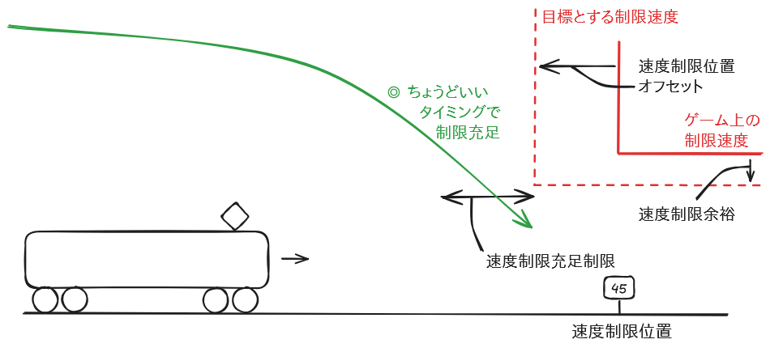

いい感じにブレーキをかけたい
============================

「すごい！ブレーキ操作を全くしていないのに停止位置から数十cm以内で止まって2段制動3段緩め成功判定！？」  
「いったいどんな魔法を！？」  
「何って…止まるまでの距離に応じてATOのAPIでブレーキを調整しただけだが？」

## これは何？

[TRAIN CREW](https://acty-soft.com/traincrew/) 用の運転支援ツールです。  
速度の変化から**加速度を計算**し、さらに一定の加速度で走行した場合に**停車や速度制限充足までに進む距離を計算**します。  
リアルタイムの加速度で計算を行うだけでなく、それぞれの強さのブレーキを用いた際の加速度も記録し、これを用いていい感じに停車・速度制限充足ができるように**自動でブレーキをかける**こともできます。

## デモ動画

[【TRAIN CREW】何って…止まるまでの距離に応じてブレーキを調整しただけだが？ - YouTube](https://www.youtube.com/watch?v=-neBXJ7l6fg) (2分24秒)

## 仕組み

### 速度・加速度から停車・速度制限充足までの走行距離を求める

現在の速度を $v \textrm{[m/s]}$、加速度を $a \textrm{[m/s}^2\textrm{]}$ とします。  
加速度が一定だとすると、 $t \textrm{[s]}$ 後の速度は

$$v_t = v + a t \textrm{[m/s]}$$

となります。  
さらに、 $t \textrm{[s]}$ 後までに進む距離は

$$x_t = \int_0^t v_u du = v t + \frac{1}{2} a t^2 \textrm{[m]}$$

となります。

さらに、目標とする速度を $v^\* \textrm{[m/s]}$ とすると、この速度になる時刻 $t^\* \textrm{[s]}$ は

$$v^\* = v_{t^\*} = v + a t^\*$$

を満たします。これを解くと

$$t^\* = \frac{v^\* - v}{a}$$

となります。これを $x_t$ の式に代入すると、目標とする速度になるまでに進む距離 $x^\* \textrm{[m]}$ は

$$
\begin{eqnarray}
x^\* = x_{t^\*} &=& v \left(\frac{v^\* - v}{a}\right) + \frac{1}{2} a {\left(\frac{v^\* - v}{a}\right)}^2 \\
&=& \left(\frac{v^\* - v}{a}\right) \left(v + \frac{1}{2} a \left(\frac{v^\* - v}{a}\right)\right) \\
&=& \left(\frac{v^\* - v}{a}\right) \left(\frac{v^\* + v}{2}\right) \\
&=& \frac{{v^*}^2 - v^2}{2a}
\end{eqnarray}
$$

となります。

よって、 $a < 0$ かつ $v^\* < v$ のとき (すなわち、現在の速度より低い速度に向かって減速中であるとき) は、この式において停車を考えるときは $v^\* = 0$ とし、速度制限を考えるときは $v^\*$ に満たすべき制限速度を代入することで、停車や速度制限充足までに進む距離 $x^\*$ を求めることができます。

### 自動ブレーキの考え方 (基本)

自動ブレーキは、通常の走行中、すなわち以下の条件を全て満たしたときのみ有効になります。

* ゲーム中である
* ポーズ中でない
* レバーサが「前進」状態である
* 力行していない (マスコンが N 以下)

さらに、手動でブレーキ (抑速を含む) をかけている場合のみ有効にする設定もできます。

このソフトウェアにおける自動ブレーキの目的は、

* 停止位置またはそれより手前に停まること
* ただし、停まる位置が停止位置より手前になりすぎないようにすること

です。

これを実現するため、以下の条件の**いずれか**を満たした場合、(緩められるならば) ブレーキを緩めます。

* ブレーキを緩めても、停止位置またはそれより手前に停まれそう
* 今のままだと停まる位置が停止位置より手前になりすぎてしまいそう

また、以下の条件を**すべて**満たした場合、(強められるならば) ブレーキを強めます。

* 今のままだと停止位置を過ぎて (過走して) しまいそう
* ブレーキを強めても、停まる位置が停止位置より手前になりすぎてしまわなそう

「今のまま」の場合の予測は、リアルタイムの加速度を用いて行います。  
ブレーキを緩めた・強めた場合の予測は、ブレーキの状態ごとに記録した加速度を用いて行います。

今のままだと過走しそうだが、ブレーキを強めると停止位置より手前すぎる位置で停まってしまいそうなときは、このまま走行を続け、少し後でブレーキを強めることでちょうどいい位置に停まれることが期待できるため、ブレーキの強さを変えないようにします。

### 自動ブレーキの考え方 (速度制限)

自動ブレーキが有効である場合、停止位置に停まるだけでなく、予告された速度制限も満たすことを目標にブレーキの操作を行います。

指定の位置までに指定の速度以下に減速することが求められるのはもちろん、あまりにも早く減速しても遅延の原因になってしまいます。  
よって、速度制限についても、停車と同様に

* 指定の位置またはそれより手前で速度を指定以下にすること
* ただし、速度を指定以下にする位置が指定の位置より手前になりすぎないようにすること

が目的になります。

ただし、停車の場合は 1cm 手前に停まっても 1cm 過ぎて停まっても同じペナルティになりますが、速度制限は超えてはいけません。  
そこで、実際の速度制限よりも厳し目の速度制限を満たすことを目標にすることで、多少超えても実際の速度制限を超える可能性を減らすようにしました。  
「速度制限余裕」で制限速度を下げ、「速度制限位置オフセット」で速度制限を行う位置を手前にずらします。

## 使用上の注意点

> [!CAUTION]
> 自動ブレーキ機能を用いると、簡単に停止位置付近に停車でき、2段制動3段緩め成功判定も出やすいため、**高いスコアが出やすくなります。**  
> そのため、**実力によるプレイのハイスコア情報が破壊されてしまう可能性があります。**  
>
> * 最初にわざと遅れて発車することで、定時運転の加点を避け、スコアを下げる
> * 最後の駅などに停車したら、すぐにポーズをかけて運転中止し、ハイスコアの記録を避ける
>
> などの対策を行うことで、このようなハイスコア情報の破壊を避けられる可能性があります。  
> ただし、もとのハイスコアが低すぎる場合は、遅れて発車するだけでは**ハイスコアの更新を避けられない可能性**もあります。
>
> これらの対策を怠る・操作を誤るなどによりハイスコア情報が破壊されるなどの損害が発生しても、**本ソフトウェアの作者は責任を負いません。**

本ソフトウェアの自動ブレーキ機能は実験的な位置付けであり、以下の制限事項があります。  
正確・高性能な制御を求める場合は、他の作者様のTASC (例：[TrainCrewMoniter](https://github.com/suine97/TrainCrewMoniter)) を用いることを推奨します。

* 早い段階でブレーキをかけ始めるため、遅延が発生しやすいです。
  * 停車予定までの時間は考慮しません。
  * 状況に応じ、P1への投入や「手動ブレーキ時のみ」機能により自動ブレーキの発動を抑えることで、改善する可能性があります。
* 乗り心地への配慮は行いません。
  * たとえば、停車の直前はB1を用いる、などの制御は行いません。
  * 「基本制動」なども考慮しません。
* ブレーキ操作の加速度への反映が遅い車種・状況では、不正確な加速度が記録され、不適切な操作が行われる可能性が上がります。
  * 「連続操作制限」「加速度記録制限」を大きな値にすることで、改善する可能性があります。
* 「速度制限位置オフセット」を大きくしすぎると、停車に支障が出る可能性があります。
  * 停車位置のすぐ先に 0km/h の速度制限が設定されている場合、速度制限を充足しようとする位置が停車位置より手前になることにより、停車位置より手前に停車してしまう可能性があります。
* 力行中は自動ブレーキが無効になります。
  * 速度制限位置や停車位置に近づきすぎてから自動ブレーキを開始しても、間に合わない可能性があります。
  * ノッチの切り忘れ・切り損ねに注意してください。
* 予告が出ない速度制限には対応できません。
  * 状況に応じて手動でブレーキをかけるなどの対応を行ってください。
  * TRAIN CREW 画面下部の「ガイドメッセージ」は、速度制限の予告とはみなせません。
  * たとえば、江ノ原信号場を高速で通過後大道寺に停車する際、早い段階で 40km/h の速度制限の予告が出るため、その手前にある 55km/h の速度制限の予告が出ず、本ソフトウェアが認識できない場面がありました。
  * 速度制限が一旦予告され、その後別の速度制限の予告により隠された場合は、記憶して対応を行います。

## ライセンス

「いい感じにブレーキをかけたい」は、MITライセンスです。

TrainCrewInput.dll (TRAIN CREW 入出力ライブラリ) は溝月レイル/Acty様の制作物であり、MITライセンスの対象外です。  
TrainCrewInput.dll の解析や改変は禁止されています。

## ビルド方法

Windows 環境では、以下の方法でビルドを行います。

1. `make` コマンドを使えるようにする  
   例えば [Make for Windows](https://gnuwin32.sourceforge.net/packages/make.htm) をインストールする
2. C# コンパイラ `csc.exe` があるディレクトリにパスを通す  
   例えば `C:\Windows\Microsoft.NET\Framework\v4.0.30319`
3. `make` コマンドを実行する
